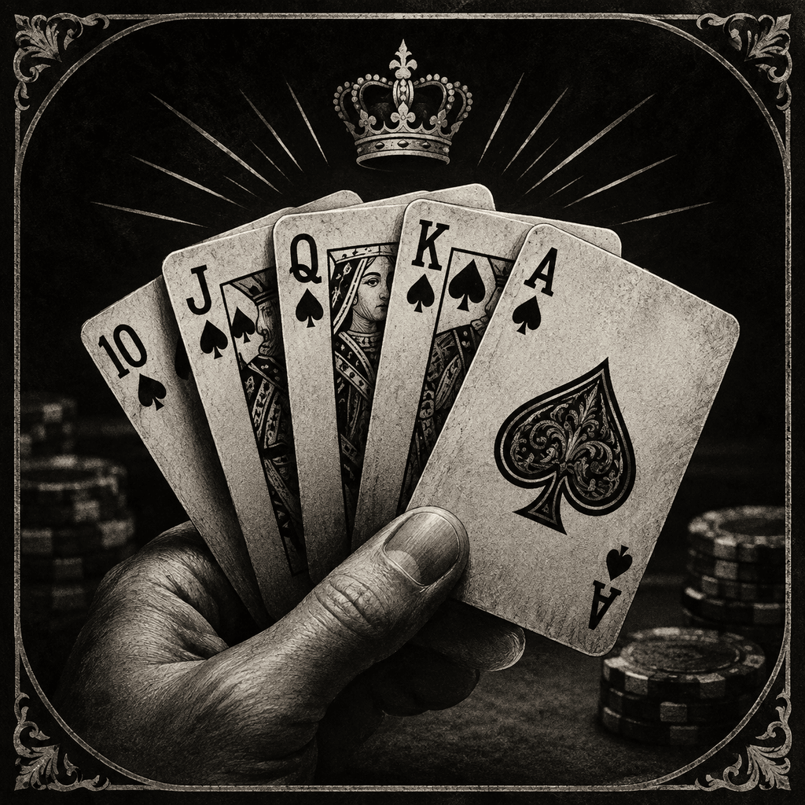

# PokerTrainer

An offline Texas Hold'em practice game for iPhone, created by **PARK, SEHO**.

PokerTrainer is a personal SwiftUI project in which the player competes against progressively more disciplined computer opponents. The long-term goal is to create a polished local poker game for casual play and solo practice without requiring Wi-Fi, an account, or a remote server.

<p align="center">
  
</p>

## Current status

The repository contains playable heads-up and one-versus-two tables. Both deal cards, validate actions, estimate equity locally, compare final hands, settle chips, and rotate positions. The heads-up campaign advances through four opponent levels; the three-player table is currently a Level 1 practice mode.

The first technical review found important betting, all-in, tie-equity, hidden-card, and asynchronous-state problems. Phase 1 replaced the original flow with a deterministic heads-up engine. Phase 2 added a separate three-seat engine, side-pot settlement, two coordinated computer turns, and a playable SwiftUI table.

## Current features

- Native iPhone interface built with SwiftUI
- Shuffled 52-card deck
- Heads-up and one-versus-two Texas Hold'em tables
- Alternating dealer, small-blind, and big-blind positions
- Check, call, raise, fold, and all-in controls
- Best-five-of-seven hand evaluation
- Ace-low straight and kicker comparison
- Monte Carlo equity estimation
- Rule-based computer opponents; four-level progression in heads-up mode
- Chip stacks, pot settlement, and level progression
- Three-player main pots, side pots, and opponent rebuys between hands
- Championship completion and campaign restart
- Automated engine, evaluator, and equity tests
- No network or third-party dependency

## How the computer opponent works

PokerTrainer does not use a trained machine-learning model.

The current decision pipeline is:

```text
Known cards
    ↓
Monte Carlo simulation of unknown cards
    ↓
Estimated hand equity
    ↓
Comparison with pot odds
    ↓
Rule-based fold, check, call, or raise decision
```

The Monte Carlo component repeatedly completes the board, deals possible opposing hands, evaluates the results, and estimates equity from the simulated outcomes. A separate decision policy uses that estimate with pot odds and controlled randomness.

### Why not machine learning or deep learning?

This was a deliberate engineering decision rather than an attempt to present a probability calculation as AI.

- The application is designed to run entirely on an iPhone without a backend.
- Training a useful poker policy would require substantial, representative, and legally usable game data.
- I did not have a sufficiently large and validated poker-hand dataset for supervised or reinforcement learning.
- On-device training would add storage, energy, thermal, and development costs that are unnecessary for this prototype.
- A Monte Carlo estimator is compact, explainable, testable, and directly suited to uncertainty in card games.
- A deterministic rule-based policy makes incorrect decisions easier to reproduce and improve.

Modern iPhones can run pre-trained Core ML models. The decision not to use ML is therefore about data quality, product scope, explainability, and offline constraints—not a claim that mobile ML is impossible. A trained model would only be justified later if the project obtains an appropriate dataset, evaluation methodology, and a clear benefit over the probabilistic approach.

## Architecture

```text
PokerTrainerApp
      │
      ▼
ContentView ──────────── Table selection
      ├── HeadsUpTableView ─── PokerGameManager ─── HeadsUpGameEngine
      └── ThreePlayerTableView ─ ThreePlayerGameManager ─ ThreePlayerGameEngine
                                             │
                  Shared Deck, Evaluator, and EquityCalculator
```

Each deterministic engine decides what happened. Its manager coordinates computer decisions and cancellable calculations, while SwiftUI presents validated state transitions. Persistence and animation remain separate future layers.

## Phase 1 corrections

| Original finding | Implemented correction |
|---|---|
| A check could skip the opponent | Each betting round now records which seats have acted |
| An all-in response could be skipped | Unequal bets keep the responding player active |
| Unmatched chips could remain in the pot | Heads-up wagers are capped to the effective stack and excess chips are returned |
| Ties received full-win equity | Tied simulations now award fractional equity |
| An older calculation could overwrite a new one | Hand and request tokens reject stale results |
| A fold could reveal hidden cards | Fold and showdown outcomes are represented separately |

The Swift Package test target currently contains 28 regression tests. They include 100 scripted heads-up hands and 60 scripted three-player hands that verify chip conservation after every action. This does not prove that the app is bug-free, but it gives the core rules a repeatable safety net.

## Current limitations

- The three-player table currently uses the Level 1 decision policy and refills eliminated computer opponents between hands; its longer campaign is planned.
- Saved games and Continue Game are not implemented yet.
- The computer policy remains equity- and pot-odds-based rather than range-aware.
- Card and chip animations, sound, haptics, and accessibility polish remain planned.
- Physical-device and long-session validation are still required before release.

## Product direction

The target version will include:

- Correct blinds, turn order, legal actions, all-ins, and pot settlement
- Chips instead of real-money presentation
- Heads-up and player-versus-two-computer tables
- Main-pot and side-pot support
- Stronger range- and position-aware computer opponents
- Automatic local save and Continue Game support
- Card dealing, card flip, chip movement, and pot-award animations
- A final-table victory sequence and campaign restart
- Hand history and decision feedback for solo practice

See the concise [Roadmap](docs/ROADMAP.md) and [Development Log](docs/DEVELOPMENT_LOG.md).

## Project structure

```text
PokerTrainer/
├── README.md
├── Package.swift
├── docs/
│   ├── PORTFOLIO.md
│   ├── DEVELOPMENT_LOG.md
│   └── ROADMAP.md
├── PokerTrainer.xcodeproj/
├── PokerTrainer/
    ├── PokerTrainerApp.swift
    ├── ContentView.swift
    ├── PokerGameManager.swift
    ├── ThreePlayerContentView.swift
    ├── ThreePlayerGameManager.swift
    ├── PokerGameEngine.swift
    ├── MultiplayerPokerEngine.swift
    ├── Card.swift
    ├── Evaluator.swift
    ├── EquityCalculator.swift
    └── Assets.xcassets/
└── PokerTrainerTests/
    ├── PokerGameEngineTests.swift
    ├── ThreePlayerGameEngineTests.swift
    ├── EvaluatorTests.swift
    └── EquityCalculatorTests.swift
```

## Running the project

1. Clone the repository.
2. Open `PokerTrainer.xcodeproj` in Xcode.
3. Select the `PokerTrainer` scheme.
4. Choose an iPhone simulator or connected iPhone.
5. Select your development team if physical-device signing is required.
6. Build, run, and choose a 1 vs 1 or 1 vs 2 table.

To run the core regression suite from Terminal:

```bash
swift test
```

The project currently targets iOS 26.5 and uses automatic signing with the bundle identifier `com.sehopark.PokerTrainer`.

## Technology

- Swift
- SwiftUI
- Combine observation
- Swift Concurrency
- Monte Carlo simulation
- Recursive combination generation
- Apple frameworks only

## Documentation

- [Portfolio Summary](docs/PORTFOLIO.md)
- [Development Log](docs/DEVELOPMENT_LOG.md)
- [Product Roadmap](docs/ROADMAP.md)

## Author

**PARK, SEHO**  
Independent developer and project designer
