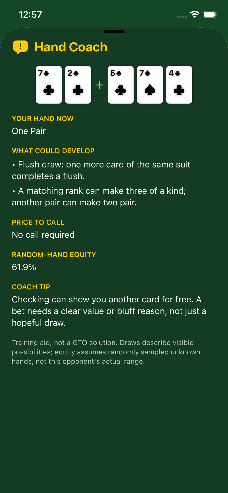
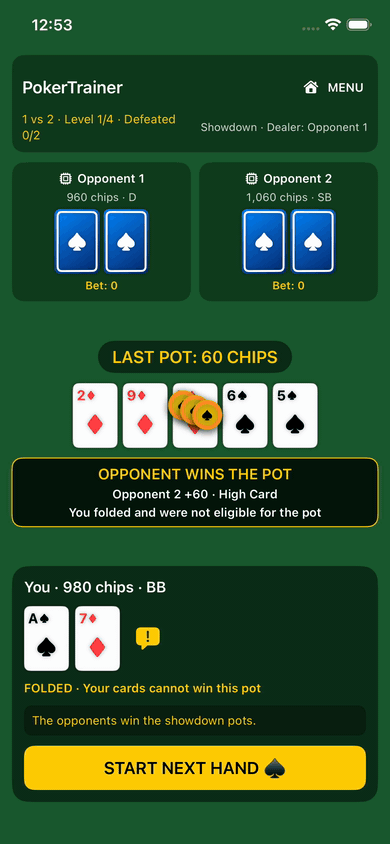

# PokerTrainer

An offline Texas Hold'em game for iPhone, designed and developed by **PARK, SEHO**. Play against one or two computer opponents, earn chips, and clear four opponent levels designed to increase the challenge. No account, Wi-Fi, server, real-money betting, or trained AI model is required.

<p align="center">
  
</p>

## Current build

- Playable 1 vs 1 and 1 vs 2 SwiftUI tables with separate four-level campaigns. Both modes increase blinds by level; 1 vs 2 also increases blinds every 12 completed hands (capped at five extra increases per level). Later-level opponents receive stacks scaled against the player's accumulated chips.
- Standard 52-card Hold'em dealing; dealer and blind rotation; check, call, raise, fold, and all-in actions.
- Best-five-of-seven hand evaluation, kickers, ace-low straights, ties, main/side pots, and unmatched-chip refunds.
- Local, versioned save/continue after each action. The MENU button works during a hand, so players can switch modes and resume either table. In 1 vs 2, an eliminated opponent sits out until the next level; the two remaining seats play heads-up.
- On-device Monte Carlo equity estimation and rule-based opponents whose position, board-context, bet sizing, and playing personality vary by level.
- A tap-to-open Hand Coach beside the player's cards explains the current made hand, direct draws and upgrade paths, call price, and a cautious strategy tip. It does not claim to know hidden cards or solve GTO.
- Staggered card dealing, showdown flips, chip contributions, and visible pot-to-winner payouts, plus a result banner naming the winner, awarded chips, and winning rank when revealed. Reduced Motion disables moving effects.
- 78 default core tests pass; two opt-in difficulty benchmarks and a 500-hand-per-mode save/restore stress test also pass. Both four-level campaigns were won with random deals in an iPhone Simulator on an earlier balance build; the earlier 1 vs 2 victory ended with both opponents out and 21,000 chips. The newly rebalanced full campaigns have not yet been manually cleared.
- In a separate, approximately 16-minute iPhone 17 session, 1 vs 2 Level 1 was cleared and Level 2 began; 1 vs 1 reached Level 1 Hand 8. Background return and force-quit/relaunch restored in-progress hands in both modes. No crash or freeze was observed in that bounded run.
- In a later user-reported play session, the battery display read 94% at 12:06 and 94% at 12:23 (17 minutes; 0 displayed percentage-point change), with almost no perceived heat. The player cleared the earlier-build 1 vs 1 campaign in about 10 minutes and reached the middle of 1 vs 2 Level 3 in about 5 minutes; that feedback prompted the new balance changes. Displayed battery percentage is too coarse to establish actual energy use.

<p align="center">
  
  
</p>

The UI uses chips, not money. The displayed “random-hand equity” estimates results against uniformly sampled unknown hands. It does **not** predict an opponent's actual betting range or guarantee a win.

## Why probability, not machine learning?

Monte Carlo simulation is a numerical technique, not a trained model. I did not have a sufficiently large, representative, validated poker-hand dataset to train and evaluate an ML policy. Training on an iPhone would add storage, energy, thermal, and implementation costs to an offline project without a demonstrated benefit. A local simulator plus a transparent decision policy is compact, testable, and explainable. Modern iPhones can run pre-trained ML models; this is a product- and data-quality choice, not a claim that mobile ML is impossible.

## Design

```text
SwiftUI tables and menu
    ↓
Game managers: computer decisions, cancellable equity work, local saves
    ↓
Deterministic heads-up / three-seat rule engines
    ↓
Shared deck, hand evaluator, equity estimator, opponent strategy
```

The rule engines own legal actions and chip settlement. UI animations cannot decide a winner or move chips in the underlying game. Save loading validates cards, chips, turn order, and campaign state. Each table has an independent save file inside the app's local container.

## Build and test

Open [PokerTrainer.xcodeproj](PokerTrainer.xcodeproj) in Xcode, choose the `PokerTrainer` scheme, and run it on an iPhone Simulator. Select a development team for a physical device. The minimum deployment target is iOS 26.0.

Run the core regression suite with:

```bash
swift test
```

To repeat the exploratory level comparison on the same seeded deals in both modes (set `POKERTRAINER_BENCHMARK_STYLE` to `passive`, `selective`, or `pressure`):

```bash
POKERTRAINER_BENCHMARK=1 swift test --filter OpponentDifficultyBenchmarkTests
```

The default is 48 deals with short equity estimates. `POKERTRAINER_BENCHMARK_HANDS` changes the deal count, and `POKERTRAINER_BENCHMARK_PRODUCTION=1` uses the app's opponent decision sample counts (1,200 in 1 vs 1; 800 in 1 vs 2).

For a longer, opt-in core save/restore run:

```bash
POKERTRAINER_STRESS=1 swift test --filter LongSessionStabilityTests
```

## Limitations and next work

- The smaller iPhone 17e Simulator was checked in both modes with Reduced Motion on and off, and a cramped 1 vs 1 control layout was corrected. The new coach, menu switch, result banner, and pot payout were checked in the Simulator; the updated build still needs physical-device and additional-size review.
- Paired-deal comparisons against passive, selective, and aggressive player policies are useful diagnostics, not a general strength rating or evidence of professional-level play. The rebalanced campaign needs longer and human-opponent validation.
- The 17-minute battery observation and subjective heat report are encouraging but not a calibrated energy or thermal measurement. Accessibility and hand-history polish remain open.
- Local saves are removed when the app is uninstalled. There is no cloud synchronization.

See the [portfolio summary](docs/PORTFOLIO.md), [development log](docs/DEVELOPMENT_LOG.md), and [roadmap](docs/ROADMAP.md).

## Author

**PARK, SEHO** — independent developer and project designer.
